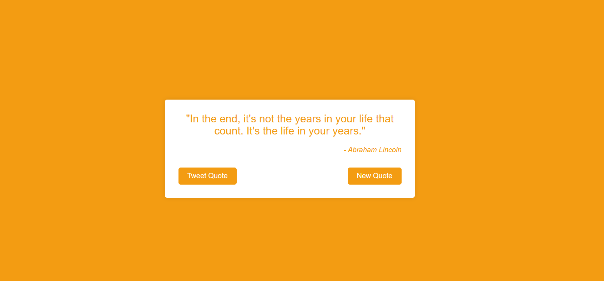

# Unlimited Quote Machine 🌈

A dynamic web application that fetches and displays unlimited random quotes with beautiful color transitions.

 *(Replace with your actual screenshot)*

## Features ✨

- **Unlimited Quotes**: Fetches random quotes from the Quotable.io API
- **Beautiful Transitions**: Smooth color and fade animations
- **Tweet Sharing**: Share your favorite quotes on Twitter
- **Responsive Design**: Works on all device sizes
- **Modern UI**: Clean, elegant interface with dynamic colors

## Technologies Used 🛠️

- HTML5
- CSS3 (with animations and transitions)
- JavaScript (ES6+)
- [Quotable.io](https://api.quotable.io) API

## Installation 💻

1. Clone the repository:
   ```bash
   git clone https://github.com/Tikesh-sahu-git/Quote.git
